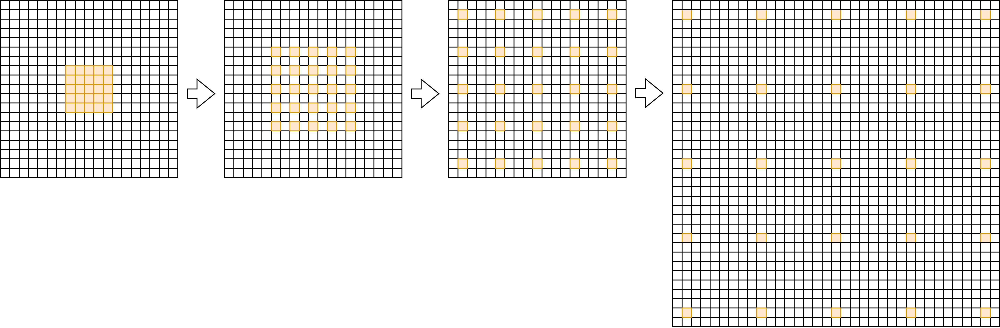

# Denoise Bonus
This repository is for bonus of the course project of CS3327. The main task is implement À-Trous Wavelet algorithm to speedup the `Filter` function in `src/denoiser.cpp`.

The main idea of the À-Trous Wavelet algorithm is filtering with a fixed size filter core for multiple times with different margin between sample points.

Assuming the `kernelRadius` is 16 and the core's width is 5 then the procedure is as below:

---
此仓库为CS3327的大作业附加部分。主要任务为实现À-Trous Wavelet算法，加速`src/denoiser.cpp`中的`Filter`函数。

À-Trous Wavelet算法的主要思想是使用固定大小的滤波核采用不同的采样点间距多次滤波。

假设`kernelRadius`是16，滤波核宽为5，则流程如下图：
